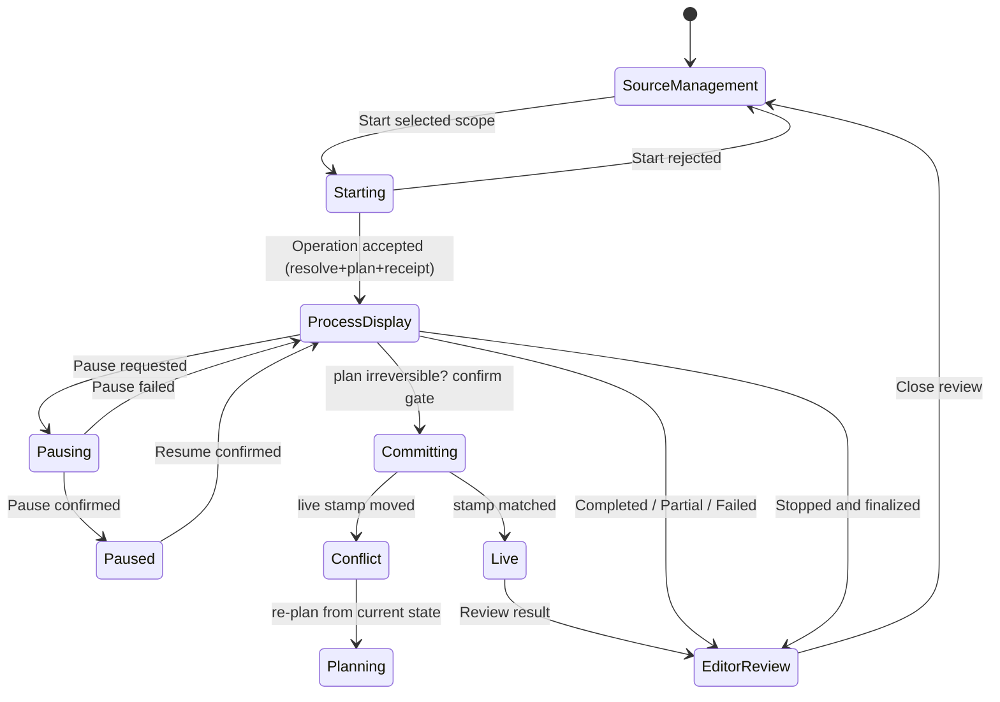

# OneShot — Safe Operation Lifecycle (Design Reference)

> Status: reference draft for review. Lives in `temp/`. Not wired into the app.
> Constraint honored throughout: **no external tool API names or data models are
> copied.** Every concept is re-expressed in OneShot's own vocabulary.

## 0. Method — one workflow, reused for the rest

Per the agreed approach, we do **not** extract a pile of rules at once. We
extract **one simple workflow**, lock it in as the **main active workflow**, and
then reuse that same spine to derive every other behavior. Consistency and
quality come from reusing a single proven shape rather than re-deriving it.

The one workflow is the **single safe operation** — the mutation counterpart to
OneShot's existing preparation run. Everything else (`relink`, the confirmation
gate, write-only masking, multi-step chaining) is a *variation* of it.

## 1. The main active workflow

```
            ┌───────────────────────────────────────────────────────────┐
            │                    SINGLE SAFE OPERATION                    │
            │                                                             │
  intent ──►│  resolve ─► plan + receipt ─► [gate] ─► stage ─► commit     │──► live
            │    │            │                       (working set) (stamp)│
            │    └──── checkpoint(pause/stop) ────────────┘   │            │
            │                                                 ▼            │
            │                                    trace + findings ─► terminal│
            └───────────────────────────────────────────────────────────┘
```

Phase-by-phase, in OneShot terms:

| Phase | What it does | Safety property it carries |
|---|---|---|
| **resolve** | Gather prerequisites before touching anything | Never act on unknown/missing state |

## 2. Where it fits — grounded in the existing diagrams

The workflow is not new territory; it sits on OneShot's own state spine.

**`state-driven-transition.png`** is the operational spine:

```
SourceManagement ──Start selected scope──► Starting ──Operation accepted──► ProcessDisplay
                                          ▲                                  │  │
                     Start rejected ──────┘                          Pause ──┘  └──► EditorReview
                                                                    Pausing/Paused   (Completed/Partial/Failed,
                                                                                     Stopped and finalized)
```

Mapping the single safe operation onto it:

| Diagram state | Single-safe-operation phase |
|---|---|
| `Starting` | resolve + plan + receipt (capture stamp) |
| `ProcessDisplay` | stage (working set) + cooperative pause/stop checkpoints |
| the commit step | gate (if irreversible) → commit against stamp |
| `EditorReview` + terminal labels | trace + findings + frozen snapshot |

**`workflow-diagram.png`** is the *content* that flows through that spine
(Intake → Identify → Inspect → Summarize → Quality & Coverage → outcomes), with a
parallel **System Activity / Trace**. The single safe operation governs the
*mutations* along that flow; the trace node is where every phase is recorded.

## 3. Scope boundary — upstream only (per instruction)

- **IN SCOPE (upstream safety frame):** resolve, plan/receipt, working-set
  staging, concurrency stamp, confirmation gate, cooperative pause/stop, safe
  relink, write-only masking, trace/findings.
- **OUT OF SCOPE (downstream payloads/outcomes):** the delivered results
  (`Prepared Context / Partial + Gaps / Report Limitation`), and any reference
  payload specifics (email bodies, webhook schemas, step-positioning semantics,
  account lookups, trigger conditions).

This is also *how* "no copied API names or data models" is satisfied structurally:
the reference's copied vocabulary all lives downstream, so excluding downstream
removes the copying risk by construction.

## 4. Re-write — OneShot-native vocabulary (no copied names/models)

| Reference concept (must NOT copy) | OneShot-native rewrite |
|---|---|

## 5. Variations of the one workflow (reuse, not reinvention)

Each remaining behavior is the same spine with one plug-in point changed — proof
that consistency comes from the single main active workflow.

| Variation | What changes | What stays identical |
|---|---|---|
| **Safe relink** | the `plan` step emits a `relink({ id, position, anchorId })` | resolve → receipt → stage → commit → trace |
| **Confirmation gate** | a **stage-gate**: `stage` is deferred until `confirm()` | everything except the gate wait |
| **Write-only masking** | the **publish-snapshot** step masks sensitive keys | trace/commit/terminal |
| **Multi-step chaining** | run the **same** loop repeatedly, each a child operation | the loop itself is unchanged |

### Safe relink rule (the one unambiguous positioning rule)

`relink(chain, { id, position, anchorId })` over `{ id, next }` nodes:

- `lead` → becomes the head; `tail` → becomes last; `follow` → placed right
  after `anchorId`.
- **No `precede`.** To place before X: use `follow` with X's predecessor, or
  `lead` when X is the head. One rule, not two overlapping verbs.
- Rejects: unknown node, unknown/self anchor, and any result that is not a
  single acyclic chain covering every node (nothing dangles, nothing orphans).

## 6. State diagram (extends `state-driven-transition.png`)



## 7. Benchmark — validated against best market practice

The design is checked against established patterns before delivery. The full
evidence lives in `GAP-ANALYSIS.md` (which corrects this section's earlier
over-generous 10/10 claim). Honest scoreboard: **7 Full, 3 intentional Partial**.

| Practice | Where it lands in this design | Status |
|---|---|---|
| Optimistic Concurrency Control (stamps/versions/ETags) | atomic `casStamp` when offered; mismatch ⇒ conflict | ✅ Full |
| Saga / compensating actions | `PartialCommitError` ⇒ reverse `compensate` ⇒ `rolled-back` | ✅ Full |
| Two-phase commit feel | stage (prepare) → `commit-decision` anchor → commit (apply) | ✅ Full |
| Unit of Work | the single safe operation frame (one plan per operation) | ⚠️ Partial — intentional per-op model |
| Event sourcing / append-only audit | trace rows recorded every phase (audit log, not event source) | ⚠️ Partial — correct as audit |
| Cooperative cancellation (CancellationToken / context) | pause/stop honored at `_checkpoint` only | ✅ Full |
| Idempotency key / one-time token | `receipt = digest(plan)` + receipt→result replay store | ✅ Full |
| Secrets management — write-only, never logged | `maskSensitive` on published snapshots (redaction, not encryption) | ⚠️ Partial — host/storage concern |
| CQRS-lite — draft vs published separation | working set vs live state | ✅ Full |
| JSON Patch / additive-over-replace | `relink` + `validatePlan` gate before staging | ✅ Full |

**Honest gaps (per OneShot's capability-reporting rule):**
- The reference module is a *model*, not yet wired to IndexedDB persistence;
  crash-recovery mid-commit is described but not implemented here.
- Concurrency is single-tab in the browser; cross-tab conflicts surface as
  `conflict` and require a re-plan (matching the existing storage guard).

## 8. Deliverable summary

- **Main active workflow:** the single safe operation (§1), proven runnable in
  `temp/reference/lifecycle.test.mjs` + `temp/reference/lifecycle.e2e.mjs` (21/21).
- **Reuse:** relink, gate, masking, chaining are variations of it (§5).
- **Boundary:** upstream only; no copied API names or data models (§3, §4).
- **Benchmark:** 7 Full + 3 intentional Partial, fully evidenced in `GAP-ANALYSIS.md` (§7).

| `validate_patch` / `validation_token` | `plan()` → **receipt** = `digest(plan)` |
| `last_patch_id` / concurrency conflict | **live stamp** compare → `ConflictError` → re-plan |
| `publish` (go live) | **commit** against matching stamp |
| working draft vs published | **working set** vs **live state** (mirrors `draft`/`saved`) |
| `position: entrypoint/tail/after` | **`relink`** with `lead` / `tail` / `follow` (no `precede`) |
| `account_id` / `automation_id` lookups | local **workspace scope**; ids via `crypto.randomUUID` (your convention) |
| write-only secret | **`maskSensitive`** on every published snapshot |
| "log the gap when blocked" | **`findings[]`** with `severity` (your existing shape) |
| trigger condition | operation **precondition** resolved in the resolve step |

The rewrite reuses OneShot's existing primitives so it reads as native: frozen
snapshots, `EventTarget` + `update` events, cooperative `_checkpoint`,
`structuredClone`, the `draft`/`saved` split, and serialized IndexedDB writes.

| **plan** | Build the plan; compute a stable **receipt** (`digest(plan)`); capture the live **stamp** | Intent becomes a checkable, reproducible artifact |
| **gate** | If the plan is irreversible, wait for explicit `confirm()` | "Go live" only on clear user intent |
| **stage** | Write to the **working set** only — never live state | Destructive change is isolated and discardable |
| **commit** | Re-read the live stamp; if it moved → `conflict`; else apply | No blind overwrite of concurrent change |
| **terminal** | Record trace + findings; freeze a snapshot | Honest, inspectable, recoverable record |

Cooperative **pause/stop** are honored at checkpoints between phases, exactly as
OneShot's existing preparation engine does, so a long operation is held at a
consistent boundary and the working set can resume or be discarded safely.
